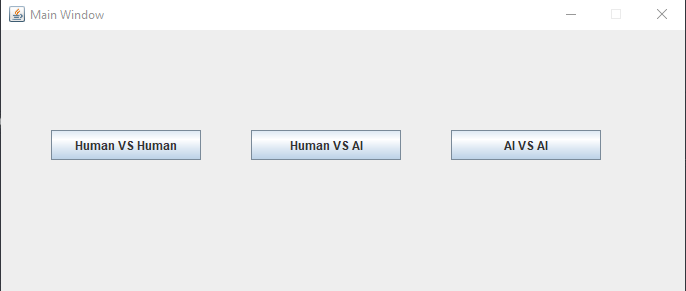
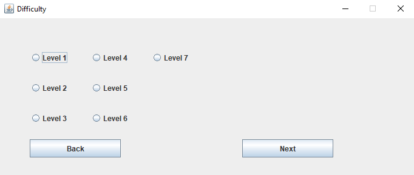
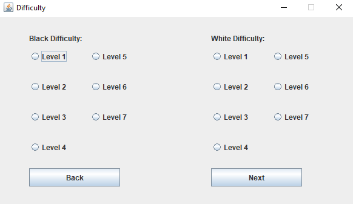
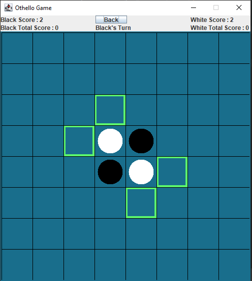

# Othello Game Ai

This is our Project for the CSE472s Artificial Intelligence Course.

## Supported Game Modes

- Human Vs Human Mode. 🧑🧑
- Human Vs Ai Mode. 🧑🤖
- Ai Vs Ai Mode. 🤖🤖
## Algorithm Used
- Level 1: Plays Randomly From Set of All Available Moves.
- Level 2-7: Uses MiniMax Algorithm With Alpha Beta Pruning.
## Heuristics For Evaluation
- Coin Parity.
- Mobility.
- Corners Captured.
- Stability.

All of these Heuristics were taken from [this paper](https://courses.cs.washington.edu/courses/cse573/04au/Project/mini1/RUSSIA/Final_Paper.pdf).
## Manual
### Main Menu

Choose The Desired Game Mode.
### Human Vs Ai Menu

- Choose the Difficulty of the Ai Player.
- Press Back to return to main Menu.
### Ai Vs Ai Menu

- Choose the Difficulty of the Two Ai Players.
- Press Back to return to main Menu.
### Game Window

- Available Moves are Highlighted. 
- Press Any Available Move to Play.
- Turn, Current Scores and Total Scores are all Displayed on the Top.
- Press Back to return to Main Menu.
